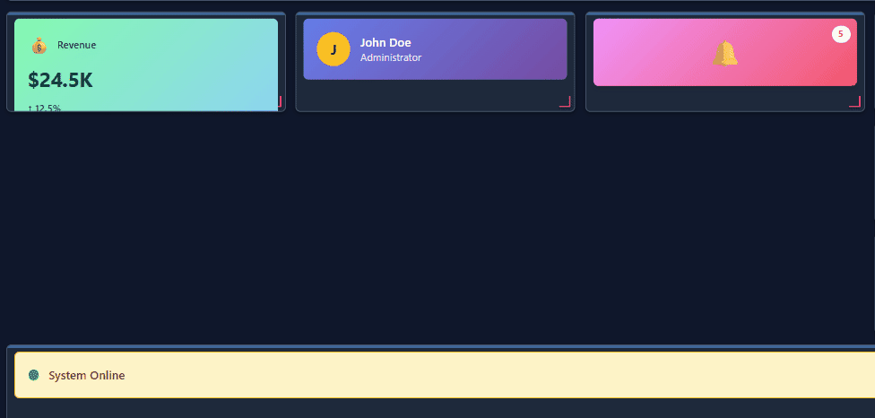
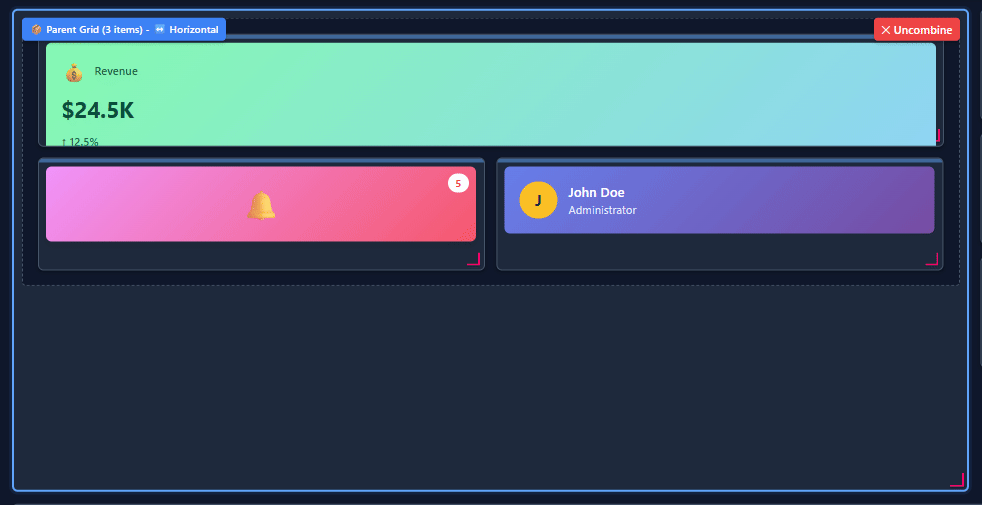
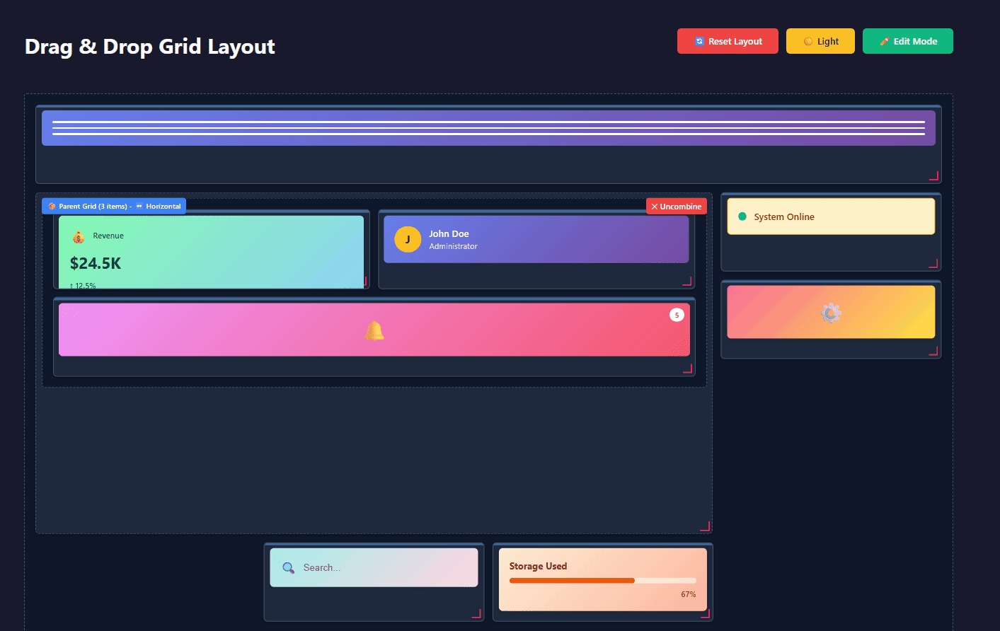
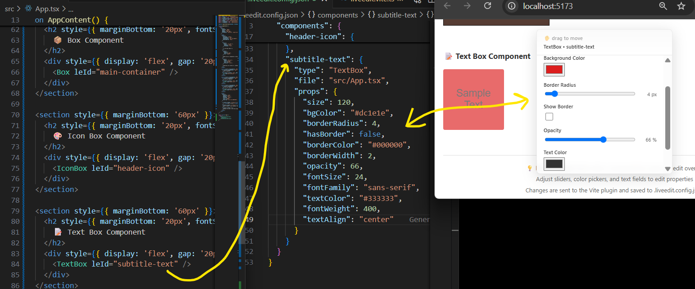

# Live Edit React

## V3 Grid Layout

Edit the layout of child components without poking around Grid/Box code to get layouts as visually desired.

Another live edit component, the interactions with the UI will update the `.liveedit.config.json` which will cause hot reloading to reflect the changes.
Therefore refreshing the page, restarting app, etc. will keep changes ofc.

Doesn't currently have a production 'baked in' mode but that would be necessary.

<div align="center" style="display:flex;justify-content:center;gap:16px;flex-wrap:wrap;">
  <h2>Create Nested Grids</h2>
  
  <h2>Row/Horizontal vs Column/Vertical Orientation</h2>
  

  <h2>Edit Mode vs Actual View</h2>
  
</div>

- Needs following fixes/improvements:
  - Address desired padding in edit vs view mode, and configuring the padding changes. Perhaps try adding padding as a uniform, per 'parent Grid' configurable instead of per component child.
  - In the edit mode, if a component doesn't fit well within its cell it just gets cut off I guess? 
  - Maybe have an 'empty block' option to add if someone wants to get a layout just right with empty spaces/gaps that are too large for padding and margin edits. idk
  - Dragging around is weird with 0 collisions on the grid possible, kind of hard to get something in the 'right' spot
  - Lot more. Much jank.  

---
---

## V2 Box Components

- Instead of directly editing props of the component with `line:col` style in the file (was fragile), uses `.liveedit.config.json` to store the editable props instead, which the component uses to render.
- Uses inheritance (Box and children TextBox and IconBox) to avoid needing unique props and menus for each component type.
- The menu kinda sucks still, not happy with it.
  - It's cumbersome to use and if I hate using it, so would other devs. Need something smoother and more intuitive. 
- Would want to make sure `.liveedit.config.json` is baked into the production build and not just hanging out. Would probably be better for performance (?)
- This would require developers to make sure they use unique `leId` or key, whatever for each 'live edit component'. `.liveedit.config.json` could grow quite big if you had even just dozens of these types of components. Definitely not worth it for the features provided currently, imo.

<div align="center" style="display:flex;justify-content:center;gap:16px;flex-wrap:wrap;">
  
  
</div>

---
---

## V1 Box Components

<div align="center" style="display:flex;justify-content:center;gap:16px;flex-wrap:wrap;">
  
  
</div>

---
---


## Interactive UI development

Proof-of-concept demonstrating real-time code editing through UI interactions. When you drag a slider in the browser, the source code updates automatically and hot-reloads instantly.

This is inspired by Bret Victor's work on immediate feedback in programming, particularly his talk [Inventing on Principle](https://vimeo.com/906418692).

Hot reloading is awesome because you can type in code changes and see them reflected instantly without refreshing the page. But what if these changes in React components could be bi-directional? As in, interacting with the UI resulting in code changes.

This demo was bootstrapped heavily with Zencoder's AI agents.

**These are some of the current challenges**

- At first I envisioned some sort of interactive React Component library. However, this proof of concept demo relies a lot on a custom babel plugin, some gross way of determining how to locate the src code changes per component that may not scale great in a multi-file application.

- Not sure how distributing would work to different types of projects. 

- What types of components are needed? How customizable can they be? Can people easily make their own within this type of framework?

## Future Considerations

It'd be ideal to have some sort of live container box where you could render these special components and be able to move them around.

Also, dragging around some object aimlessly isn't really useful. It would likely need snap-to-grid functionality to help make layouts senseful.

The components themselves need some sort of menu or tool you could hide/show/open/close. In the menu you could do stuff with sliders, but you should be able to hide the menu away. Maybe a wheel menu could work like in VR Chat.

## Quick Start

```bash
npm install
npm run dev
```

Yo, this is fragile. Subject to crashing if dragging the slider around too aggressively. 

## How It Works

### 1. **Babel Plugin** (`babel.config.cjs`)
- Runs during compilation to annotate JSX elements with metadata
- Adds `data-le-id` (format: `"tagName:line:column"`) and `data-le-file` attributes
- These attributes are **only added in development** (`NODE_ENV !== 'production'`)
- Example: `<div>` at line 30, column 8 becomes `<div data-le-id="div:30:8" data-le-file="src/Box.tsx">`

This is a limiting way of finding the proper line of code to modify. There's gotta be a smarter way of doing this.

### 2. **React Hook** (`useLiveEdit.ts`)
- `useLiveEdit()` hook connects UI controls (sliders, etc.) to source code properties
- Extracts `data-le-id` and `data-le-file` from the DOM element via ref
- Sends POST requests to `/_liveedit/patch` when values change
- Request format: `{ file, id, prop, newValue }`

### 3. **Vite Plugin** (`liveedit.vite.ts`)
- Exposes a `/_liveedit/patch` HTTP endpoint that runs in Node.js
- Receives patch requests and reads the source file from disk
- Parses the AST using **@babel/parser** with TypeScript + JSX support
- Finds the target element by matching its **position** (line:column) in the AST
- Updates or adds the prop value using **@babel/types** builders
- Generates updated code with **@babel/generator**
- Writes changes back to disk, triggering Vite's HMR to hot-reload


The source files on disk don't have `data-le-*` attributes—they only exist in the compiled output sent to the browser.